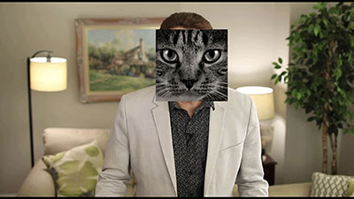

# Face Detector in Video
### Script detects faces in a video file, marks them, and writes a new video with marked faces.

#### Three modes are available:

**'r'** - faces will be marked by rectangles around them,  
**'b'** - faces will be blurred,  
**'c'** - draw cats instead of detected faces.

